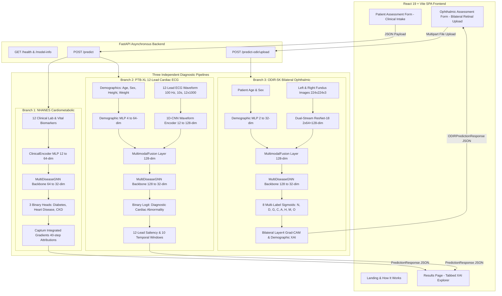

# 🩺 Explainable Multi-Disease Clinical Decision Support System

An AI-powered multimodal clinical decision-support research prototype integrating **Deep Neural Encoders**, **Patient Similarity Graph Neural Networks (GNNs)**, and **Explainable AI (XAI)** across three independent diagnostic branches.

---

## 🔬 System Overview & Architecture

The system implements **three strictly independent, decoupled diagnostic branches** designed to provide probabilistic risk estimation and model-derived explanations:



> [!IMPORTANT]
> **Cohort Isolation & Scientific Integrity:**
> 1. **Zero Synthetic Cross-Pairing:** NHANES, PTB-XL, and ODIR-5K represent separate populations (US, Germany, China) and are evaluated in isolated pipelines with 0% data leakage.
> 2. **Bilateral Ophthalmic Integrity:** The ODIR-5K model requires genuine user-uploaded bilateral images (both Left and Right eyes). Single-eye inference is not supported on the bilateral model.
> 3. **Non-Diagnostic Scope:** This software is a clinical decision-support research prototype and does not provide an automated medical diagnosis.

---

## 📊 Datasets & Data Sources

| Dataset | Diagnostic Branch | Modality | Population | Sample Count | Inputs Used | Target Outputs | Partitioning | Official Public Source |
| :--- | :--- | :--- | :--- | :---: | :--- | :--- | :--- | :--- |
| **CDC NHANES** | Branch 1: Cardiometabolic | Tabular Labs & Vitals | US Civilian Population | 6,346 records | 12 Biomarkers | Diabetes, Heart Disease, CKD | 70% Train, 15% Val, 15% Test (Patient-level) | [CDC / NCHS NHANES Portal](https://www.cdc.gov/nchs/nhanes/index.htm) |
| **PTB-XL** | Branch 2: Cardiac ECG | 12-Lead Waveforms + Demographics | Clinical Patients (Germany) | 21,799 records (18,869 patients) | 12-Lead ECG (100 Hz) + 4 Demographics | Diagnostic Cardiac Abnormality (Binary: Normal vs. Abnormal) | Folds 1–8 Train, 9 Val, 10 Test (Patient-level) | [PhysioNet PTB-XL](https://physionet.org/content/ptb-xl/1.0.3/) |
| **ODIR-5K** | Branch 3: Ophthalmic | Bilateral Fundus + Demographics | Multi-Hospital Patients (China) | 3,500 patients (7,000 images) | Left Eye + Right Eye Fundus + Age, Sex | 8 Multi-Labels: [N, D, G, C, A, H, M, O] | 2,450 Train, 525 Val, 525 Test (Patient-level) | Peking University / ODIR-5K Challenge |

*Users must comply with all respective dataset terms of use, privacy agreements, and open-access licenses.*

---

## 🧠 Model Architectures & Deep Learning Specifications

### 1. NHANES Cardiometabolic Multi-Disease Model
- **Input Features (12):** Age, Sex (Binary: 1.0=Male, 0.0=Female), BMI, Waist Circumference, Systolic BP, Diastolic BP, Fasting Glucose, HbA1c, HDL Cholesterol, Total Cholesterol, Serum Creatinine, Blood Urea Nitrogen (BUN).
- **Clinical Encoder:** MLP ($12 \to 128 \to 64$-dim) with BatchNorm1d, ReLU, and Dropout ($p=0.2$).
- **GNN Backbone:** 2-layer `SimpleGNNConv` ($64 \to 64 \to 32$-dim) with degree-normalized neighbor aggregation.
- **Classification Heads:** 3 independent linear binary heads ($32 \to 16 \to 1$) with sigmoid activation for multi-disease estimation.
- **Checkpoint:** `models/multidisease_gnn_best.pt` (`305.08 KB`, SHA256: `df923d0c26f7679040c29c0cc178fd065cac2c0292e179ff50e7dbe669570b32`).

### 2. PTB-XL Multimodal 12-Lead ECG Model
- **Input Modalities:** 4 Demographics (Age, Sex, Height, Weight) + 12-Lead ECG Waveform ($12 \times 1000$ at 100 Hz).
- **Encoders:**
  - Demographic MLP ($4 \to 128 \to 64$-dim).
  - 1D-CNN Waveform Encoder ($12 \to 32 \to 64 \to 128$-dim) using 3 Conv1D blocks with kernel sizes [7, 5, 3] and MaxPool1d.
- **Multimodal Fusion:** Concatenation ($64 + 128 = 192$-dim) projected through Linear layer ($192 \to 128$-dim) with LayerNorm and Dropout ($p=0.2$).
- **GNN Backbone:** `MultiDiseaseGNN` ($128 \to 64 \to 32$-dim) followed by a binary logit output head.
- **Checkpoint:** `models/ptbxl_multimodal/best_model.pt` (`2.03 MB`, SHA256: `48922961129a6c1a6d3594c0addfc29edc7fe90ee20f8d2a2c53e7624d0eac98`).

### 3. ODIR-5K Bilateral Ophthalmic Model
- **Input Modalities:** Demographics (Age, Sex) + Left & Right Retinal Fundus Images ($224 \times 224 \times 3$).
- **Encoders:**
  - Demographic MLP ($2 \to 32$-dim).
  - Dual-Stream Pretrained ResNet-18 (shared weights up to `layer4` + AdaptiveAvgPool2d $\to 512 \to 64$-dim per eye; combined bilateral projection $64 + 64 \to 128$-dim).
- **Multimodal Fusion:** Linear projection ($32 + 128 \to 128$-dim) with LayerNorm.
- **GNN Backbone:** `MultiDiseaseGNN` ($128 \to 64 \to 32$-dim).
- **8 Output Multi-Labels:**
  - `N` — Normal
  - `D` — Diabetes
  - `G` — Glaucoma
  - `C` — Cataract
  - `A` — AMD (Age-Related Macular Degeneration)
  - `H` — Hypertension
  - `M` — Myopia
  - `O` — Other Diseases / Abnormalities
- **Checkpoint:** `models/odir_multimodal/best_model.pt` (`108.94 MB`, SHA256: `bef283b54c4232555fa10b45dce93e8313b76b055bb38ec90eb57e714715c99c`).

---

## 🕸️ Graph Neural Network (GNN) Implementation

- **Node Definition:** Dense multimodal embedding vector $\mathbf{h}_i \in \mathbb{R}^d$.
- **Graph Construction:** $k$-Nearest Neighbors ($k=5$) using pairwise Cosine Similarity:
  $$\text{Sim}(\mathbf{h}_i, \mathbf{h}_j) = \frac{\mathbf{h}_i \cdot \mathbf{h}_j}{\|\mathbf{h}_i\|_2 \|\mathbf{h}_j\|_2}$$
- **Message Passing Operation:** Handled by `SimpleGNNConv` via degree-normalized feature aggregation with self-loops:
  $$\mathbf{h}_i^{(l+1)} = \mathbf{W} \left( \frac{1}{\tilde{d}_i} \sum_{j \in \mathcal{N}(i) \cup \{i\}} \mathbf{h}_j^{(l)} \right)$$

### ⚠️ Scientific Disclosure: Training vs. Web Inference Graph State
- **Batch Training Graph ($N = \text{Batch Size}, E = k \cdot N$):** Active cross-patient message passing occurs across batch nodes, transferring phenotypic similarity context.
- **Single-Patient Web Inference ($N = 1, E = 0$):** In single-patient web inference, the submitted patient is processed as an **isolated graph node**. The convolution resolves to a linear embedding projection without artificial edge hallucination.

---

## 📈 Verified Model Performance

*All metrics are verified from holdout test set evaluations and audit reports:*

| Diagnostic Branch | Target Condition | Accuracy | Precision | Specificity | Recall / Sensitivity | F1 Score | ROC-AUC |
| :--- | :--- | :---: | :---: | :---: | :---: | :---: | :---: |
| **Branch 1 (NHANES)** | **Diabetes Mellitus** | **88.42%** | **0.7250** | **0.9167** | **0.7632** | **0.7436** | **0.9470** |
| **Branch 1 (NHANES)** | **Heart Disease** | **89.21%** | **0.6154** | **0.9577** | **0.3810** | **0.4706** | **0.7388** |
| **Branch 1 (NHANES)** | **Chronic Kidney Disease** | **96.32%** | **0.8571** | **0.9855** | **0.8000** | **0.8276** | **0.9896** |
| **Branch 2 (PTB-XL)** | **Cardiac Abnormality** | **72.71%** | **0.8628** | **0.8617** | **0.6296** | **0.7280** | **0.8252** |
| **Branch 3 (ODIR-5K)**| **Macro Summary** | N/A | N/A | N/A | N/A | **0.2102** | **0.6863** |

### ODIR-5K Multi-Label Performance Breakdown
| Code | Condition Name | Test Positives | Test AUROC | Precision | Recall | F1 Score |
| :---: | :--- | :---: | :---: | :---: | :---: | :---: |
| **N** | Normal | 155 | **0.5129** | 0.3177 | 0.5677 | 0.4074 |
| **D** | Diabetes | 180 | **0.5771** | 0.4114 | 0.7611 | 0.5341 |
| **G** | Glaucoma | 31 | **0.8265** | 0.1225 | 0.8065 | 0.2128 |
| **C** | Cataract | 31 | **0.9239** | 0.1883 | 0.9355 | 0.3135 |
| **A** | AMD | 31 | **0.5631** | 0.0000 | 0.0000 | 0.0000 |
| **H** | Hypertension | 14 | **0.6798** | 0.0000 | 0.0000 | 0.0000 |
| **M** | Pathological Myopia | 21 | **0.8639** | 0.1205 | 0.9524 | 0.2139 |
| **O** | Other Abnormalities | 150 | **0.5433** | 0.0000 | 0.0000 | 0.0000 |

---

## 🔍 Explainable AI (XAI) Methods

1. **Cardiometabolic Biomarker Attributions (Captum Integrated Gradients):**
   - Integrates gradients across 40 steps relative to a zero baseline:
     $$\text{Attr}_i = (x_i - x'_i) \times \int_0^1 \frac{\partial F(\mathbf{x}' + \alpha(\mathbf{x} - \mathbf{x}'))}{\partial x_i} d\alpha$$
   - Displays positive/negative contribution tags for each lab value.
2. **12-Lead Temporal Waveform Saliency (PTB-XL ECG):**
   - Evaluates gradient sensitivity across 12 leads and 10 temporal windows (1-second intervals).
   - *Note on General Clinical Form:* When submitting tabular data without an ECG waveform, the backend applies an isoelectric zero baseline, correctly generating zero attribution. The frontend displays an informative banner indicating that lead-level XAI requires a raw ECG upload.
3. **Bilateral Retinal Layer4 Grad-CAM (ODIR-5K):**
   - Computes gradient-weighted activation maps from `layer4` of the ResNet-18 visual encoder for both Left and Right ocular images, yielding localized 2D attention heatmaps.

---

## 🛠️ Technology Stack Inventory

- **Backend Framework:** FastAPI `0.141.1`, Uvicorn `0.52.4`, Pydantic `2.13.5`, Python `3.12`
- **Deep Learning & Modeling:** PyTorch `2.14.0`, Torchvision `0.29.0`, Captum `0.9.0`
- **Data & Scientific Computing:** Scikit-learn `1.9.0`, Pandas `3.0.5`, NumPy `2.5.2`, SciPy `1.18.1`, Pillow `12.3.0`, WFDB `4.3.1`
- **Frontend Dashboard:** React `19.2.8`, Vite `8.2.1`, React Router DOM `7.18.2`, Vanilla CSS
- **Testing & Quality Assurance:** PyTest `9.1.1` (58 automated tests), Oxlint `1.75.0`

---

## 🌐 Backend REST API Endpoints

| HTTP Method | URL Endpoint | Request Format | Response Schema | Description |
| :--- | :--- | :--- | :--- | :--- |
| `GET` | `/health` | None | `{status, service, version}` | Service health check |
| `GET` | `/model-info` | None | Metadata JSON | Architectural specifications & metrics |
| `POST` | `/predict` | `PatientAssessmentRequest` (JSON) | `PredictionResponse` | Tabular clinical & ECG risk prediction + XAI |
| `POST` | `/predict-odir` | `ODIRAssessmentRequest` (JSON Base64) | `ODIRPredictionResponse` | Base64 ODIR fundus assessment |
| `POST` | `/predict-odir/upload` | Multipart Form (`age`, `sex`, `left_image`, `right_image`) | `ODIRPredictionResponse` | Bilateral fundus file upload assessment |

---

## 📂 Project Structure

```text
ML_project/
├── backend/
│   └── app/
│       ├── api/routes.py            # FastAPI REST endpoints
│       ├── api/schemas.py           # Pydantic v2 schemas
│       ├── services/prediction_service.py # Unified service orchestrator
│       └── main.py                  # FastAPI application entry point
├── app/
│   ├── models/                      # PyTorch encoders, fusion, GNN backbones
│   ├── graph/patient_graph.py       # k-NN patient similarity graph builder
│   ├── preprocessing/               # Tabular, ECG, and image preprocessors
│   ├── explainability/              # Integrated Gradients & Grad-CAM explainers
│   └── inference/                   # Thread-safe cached inference services
├── frontend/
│   ├── src/
│   │   ├── pages/                   # Landing, HowItWorks, Assessment, Review, Results, Ophthalmic
│   │   ├── components/              # Reusable UI cards, forms, and visualization blocks
│   │   ├── services/api.js          # Client fetch service
│   │   └── App.jsx                  # Client routing setup
│   └── package.json                 # Frontend dependencies and Vite configuration
├── ml_pipeline/                     # Model training & preparation scripts
├── models/                          # Verified PyTorch checkpoints & joblib scalers
├── reports/                         # Technical audits, verification reports, and EDA logs
├── tests/                           # 58 automated unit and integration tests
└── requirements.txt                 # Python dependencies
```

---

## ⚡ Quick Start & Setup Guide

### 1. Prerequisites
- Python 3.10+ (Recommended: Python 3.12)
- Node.js 18+ and npm

### 2. Backend Setup
```bash
# Navigate to project directory
cd ML_project

# Create and activate virtual environment
python -m venv .venv
# On Windows PowerShell:
.\.venv\Scripts\Activate.ps1
# On Linux/macOS:
# source .venv/bin/activate

# Install dependencies
pip install -r requirements.txt

# Start FastAPI backend server
python -m uvicorn backend.app.main:app --host 127.0.0.1 --port 8000 --reload
```
- Interactive API Docs: `http://127.0.0.1:8000/docs`
- Health Check: `http://127.0.0.1:8000/health`

### 3. Frontend Setup
```bash
# Open a new terminal and navigate to frontend
cd ML_project/frontend

# Install dependencies
npm install

# Start Vite development server
npm run dev
```
Open `http://localhost:5173` in your browser.

### 4. Run Verification Test Suite
```bash
# Run full PyTest test suite (from ML_project root)
pytest -q
```
*Current test suite: **58 passed, 0 failed in ~47s (100% pass rate)**.*

---

## ⚠️ Limitations & Ethical Disclosures

1. **Research Prototype Notice:** This system is an investigational decision-support tool. It has not undergone prospective clinical trials or FDA/CE regulatory clearance and must **not** be used as a primary diagnostic device.
2. **Cohort Generalizability:** Models trained on specific demographic distributions (NHANES US population, PTB-XL hospital recordings, Chinese ODIR-5K fundus images) may experience distribution shifts on diverse external cohorts.
3. **Graph Inference State ($N=1, E=0$):** Single-patient web predictions operate on an isolated graph node without dynamic cross-patient neighborhood message passing during real-time inference.
4. **Minority Class Imbalance:** ODIR ophthalmic conditions with low sample prevalence (AMD, Hypertension) demonstrate lower sensitivity and F1 scores than prevalent conditions (Cataract, Glaucoma, Myopia).
5. **Explainability Limitations:** Feature attributions (Integrated Gradients) and activation heatmaps (Grad-CAM) reflect neural gradient magnitudes, which provide transparency into model focus but do not constitute proven biological causality.

---

## 📚 Dataset Citations & Acknowledgements

If utilizing this codebase for academic research, please cite the underlying open datasets:

1. **NHANES:** Centers for Disease Control and Prevention (CDC). *National Health and Nutrition Examination Survey Data*. Hyattsville, MD: U.S. Department of Health and Human Services, CDC.
2. **PTB-XL:** Wagner, P., Strodthoff, N., Bousseljot, R. D., et al. *PTB-XL, a large publicly available electrocardiography dataset*. Scientific Data 7, 154 (2020). [PhysioNet DOI: 10.13026/x4td-x982](https://doi.org/10.13026/x4td-x982).
3. **ODIR-5K:** Peking University. *Ocular Disease Intelligent Recognition (ODIR-5K)*. International Competition on Ocular Disease Intelligent Recognition.
4. **Captum:** Kokhlikyan, N., et al. *Captum: A unified and generic model interpretability library for PyTorch*. arXiv preprint arXiv:2009.07896 (2020).

---

## 📄 License & Terms

This project is released strictly for academic, educational, and clinical research purposes under the MIT License. Users are responsible for adhering to the respective data use agreements of the CDC NHANES, PhysioNet PTB-XL, and ODIR-5K datasets.
